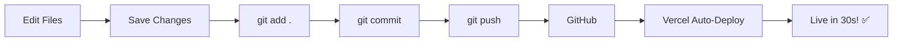

# 🌟 The Integration Studio Website

> A bilingual (English/German) website for leadership coaching, embodiment workshops, and organizational development.

## 🌐 Live Website

**Production:** https://the-integration-studio-g8gxkaasd-mr-mukundrathis-projects.vercel.app

---

## 📚 Documentation Hub

### 🚀 **New User? Start Here!**

1. **[QUICK_START.md](QUICK_START.md)** - Get editing in 5 minutes
2. **[HANDOVER_GUIDE.md](HANDOVER_GUIDE.md)** - Complete setup guide (15-30 min)
3. **[EXACT_STEPS.md](EXACT_STEPS.md)** - Copy-paste commands for daily use

### 🤖 **AI Options**

4. **[FREE_AI_OPTIONS.md](FREE_AI_OPTIONS.md)** - Compare Cursor, ChatGPT, Gemini, etc.

### 📖 **Technical Documentation**

5. **[BILINGUAL_STATUS.md](BILINGUAL_STATUS.md)** - Bilingual implementation details
6. **[IMPLEMENTATION_STATUS.md](IMPLEMENTATION_STATUS.md)** - Original build notes

---

## ⚡ Quick Reference

### For Non-Technical Users:

**Daily Workflow:**
```
1. Open Cursor IDE
2. Press Cmd + L (open AI chat)
3. Tell AI what to change
4. Save changes (Cmd + S)
5. Deploy:
   git add .
   git commit -m "Updated content"
   git push
6. Check website in 30 seconds!
```

**See [QUICK_START.md](QUICK_START.md) for detailed instructions.**

---

## 🏗️ Project Structure

```
The_integration_studio/
├── index-de.html          # German homepage
├── index-en.html          # English homepage
├── organisationen-de.html # For Organizations (DE)
├── organisationen-en.html # For Organizations (EN)
├── workshops-de.html      # Workshops & Retreats (DE)
├── workshops-en.html      # Workshops & Retreats (EN)
├── ueber-de.html         # About (DE)
├── ueber-en.html         # About (EN)
├── css/
│   └── style.css         # All styling
├── js/
│   └── main.js           # Interactive features
└── assets/
    └── logo.svg          # Optimized logo
```

---

## ✨ Features

### Current Implementation:
- ✅ **Bilingual** (EN/DE) with dropdown language switcher
- ✅ **Responsive design** (mobile-first)
- ✅ **Smooth animations** (scroll reveals, parallax effects)
- ✅ **Custom logo** (SVG, transparent, scalable)
- ✅ **Contact form** with validation
- ✅ **Modern navigation** with hamburger menu
- ✅ **Accessible** (semantic HTML, ARIA labels)
- ✅ **Fast loading** (optimized assets)
- ✅ **Auto-deployment** (push to GitHub → live in 30s)

### Design Highlights:
- **Color Palette:**
  - Olive Sage: `#8A8F5A`
  - Terracotta: `#C56A4A`
  - Charcoal: `#2C2C2C`
  - Soft Beige: `#F4EDE3`

- **Typography:**
  - Headers: TT Chocolates (fallback: Cormorant Garamond)
  - Body: Montserrat

---

## 🛠️ Tech Stack

| **Category** | **Technology** | **Why** |
|-------------|----------------|---------|
| **Hosting** | Vercel | Free, auto-deploy, fast CDN |
| **Version Control** | Git + GitHub | Track all changes, infinite undo |
| **AI Editor** | Cursor IDE | Built-in AI chat, free forever |
| **Code** | HTML, CSS, JS | Simple, no build step needed |
| **Backup AI** | ChatGPT, Gemini | Free alternatives if needed |

---

## 🎯 Common Tasks

### Change Text Content
```
Press Cmd + L in Cursor and type:
"Change the hero heading in index-de.html to [new text]"
```

### Update Contact Email
```
"Replace hello@theintegrationstudio.co with
newemail@domain.com in all files"
```

### Add New Section
```
"Add a client testimonials section after the hero
on index-de.html with 3 testimonial cards"
```

### Style Changes
```
"Change all button colors from #C56A4A to #AA5533"
```

**See [EXACT_STEPS.md](EXACT_STEPS.md) for more examples.**

---

## 🔄 Deployment Workflow



**Manual Steps:**
```bash
git add .
git commit -m "Description of changes"
git push
```

---

## 🆘 Emergency Procedures

### Undo Last Change
```bash
git revert HEAD
git push
```

### Restore to Previous Version
```bash
# Find commit hash
git log --oneline

# Restore to that commit
git reset --hard COMMIT_HASH
git push --force
```

### Check Deployment Status
1. Go to [vercel.com/dashboard](https://vercel.com/dashboard)
2. Click "the-integration-studio"
3. Check deployment logs

---

## 📋 File Editing Guide

### HTML Files (Content)
- **What:** Page structure and text
- **When to edit:** Changing text, adding sections, updating content
- **How:** Use AI in Cursor (`Cmd + L`)

### CSS File (Styling)
- **What:** Colors, fonts, layout, animations
- **When to edit:** Design changes, color updates, spacing adjustments
- **How:** Use AI: "Change all buttons to be bigger and blue"

### JavaScript File (Interactive)
- **What:** Navigation, forms, animations, language switcher
- **When to edit:** Adding new interactive features
- **How:** Use AI: "Add a scroll-to-top button"

---

## 🔐 Access & Credentials

**GitHub Repository:**
```
https://github.com/[YOUR_USERNAME]/the-integration-studio
```

**Vercel Dashboard:**
```
https://vercel.com/dashboard
```

**Cursor IDE:**
- Free tier: 2000+ AI requests/month
- No credit card required

---

## 🎓 Learning Resources

### For Complete Beginners:
1. Read **[HANDOVER_GUIDE.md](HANDOVER_GUIDE.md)** first
2. Watch: [Cursor IDE Tutorial](https://cursor.com/docs)
3. Practice: Make a small change and deploy it!

### For Learning Web Development:
- [MDN Web Docs](https://developer.mozilla.org/en-US/)
- [W3Schools](https://www.w3schools.com/)

**But you don't need to learn coding! Just use AI.** 😊

---

## 📊 Project Status

### ✅ Completed Features:
- [x] Bilingual website (EN/DE)
- [x] All 8 pages translated
- [x] Language switcher dropdown
- [x] Optimized logo (SVG, transparent)
- [x] Responsive design (mobile/tablet/desktop)
- [x] Contact form with validation
- [x] Smooth animations
- [x] Auto-deployment pipeline
- [x] Complete documentation for handover

### 🎯 Future Enhancements (Optional):
- [ ] Blog section
- [ ] Newsletter signup
- [ ] Testimonials page
- [ ] Photo gallery
- [ ] Booking system integration
- [ ] CMS for easier content editing

**All of these can be added using AI! See [EXACT_STEPS.md](EXACT_STEPS.md)**

---

## 🤝 Contributing

This is a private project, but if you want to help:

1. **Ask AI:** Press `Cmd + L` and describe what you want to add
2. **Make changes:** AI will help you
3. **Deploy:** `git add . && git commit -m "Description" && git push`

**That's it!**

---

## 📞 Support

### Getting Help:

**1. Ask AI First (in Cursor):**
```
Cmd + L → "Help me [what you want to do]"
```

**2. Check Documentation:**
- [HANDOVER_GUIDE.md](HANDOVER_GUIDE.md) - Detailed setup
- [EXACT_STEPS.md](EXACT_STEPS.md) - Command reference
- [FREE_AI_OPTIONS.md](FREE_AI_OPTIONS.md) - AI tool options

**3. Create GitHub Issue:**
```
https://github.com/[YOUR_USERNAME]/the-integration-studio/issues
```

---

## 📝 Version History

**v1.0** - Initial bilingual website
- Complete EN/DE translation
- Language switcher dropdown
- Optimized SVG logo
- Auto-deployment setup
- AI-friendly documentation

---

## 📄 License

© 2025 The Integration Studio. All rights reserved.

---

## 🙏 Credits

**Built with:**
- Claude Sonnet 4.5 (AI Assistant)
- Cursor IDE (AI-powered editor)
- Vercel (Hosting)
- GitHub (Version control)

**Design:**
- Custom design based on brand guidelines
- TT Chocolates / Cormorant Garamond typography
- Olive Sage & Terracotta color palette

---

## 🚀 Getting Started - 5 Minutes

**Complete beginner?**
1. Read [QUICK_START.md](QUICK_START.md)
2. Install Cursor
3. Make your first edit with AI
4. Deploy
5. Celebrate! 🎉

**Questions?** Everything is explained in [HANDOVER_GUIDE.md](HANDOVER_GUIDE.md)

---

**Last Updated:** March 2024
**Maintained by:** [Your Name]
**AI Assistant:** Claude Sonnet 4.5
